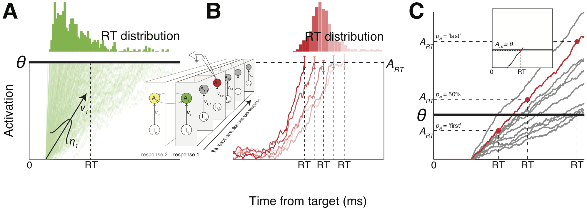

# E pluribus unum - out of many accumulators one response time

## Overview
This repository contains simulation code, accompanying the paper:

Zandbelt, B., Purcell, B. A., Palmeri, T. J., Logan, G. D., & Schall, J. D. (2014). Response times from ensembles of accumulators. Proceedings of the National Academy of Sciences, 111(7), 2848–2853. (https://doi.org/10.1073/pnas.1310577111)[https://doi.org/10.1073/pnas.1310577111].



_E pluribus unum (EPU)_ is an ensemble model of response time that embodies the well-known dictum "out of many, one". It can be used to simulate ensembles of redundant, idiosyncratic stochastic accumulators (of varying size) under various termination mechanisms and accumulation rate correlations. The model was developed to investigate how a response time that can be explained by a single model accumulator (as predicted by models from mathematical psychology) arise from numerous, redundant accumulator neurons, each of which individually appears to explain the variability of RT (as observed empirically by neurophysiologists)?

## Getting started

### Requirements

* [MATLAB](http://www.mathworks.com)
* [MATLAB Statistics Toolbox](http://www.mathworks.com/products/statistics/)
* [Panel](https://www.mathworks.com/matlabcentral/fileexchange/20003-panel) by Ben Mitch


### Intstallation

Get the code as follows:

```
git clone https://github.com/bramzandbelt/epu.git
```

You can also download the code as a ZIP file on the right.

### Usage

The most important functions are:
- epu_n_unit_accumulator.m 	=> Simulates time points within a trial
- epu_sim.m 			=> Simulates trials within a session
- epu_sim_master.m 		=> Simulates sessions
- epu_session_statistics.m	=> Computes descriptive and inferential session statistics (RT distributions, accumulation trajectories)
- epu_sim_wrapper_qr_separate.m => Specifies the most important model settings

Each of the functions contains documentation on how to use it in the docstring.

### Citation
If you intend to publish research in which you use this code, cite it as follows:

- Zandbelt, B., Purcell, B. A., Palmeri, T. J., Logan, G. D., & Schall, J. D. (2014). Response times from ensembles of accumulators. Proceedings of the National Academy of Sciences, 111(7), 2848–2853. (https://doi.org/10.1073/pnas.1310577111)[https://doi.org/10.1073/pnas.1310577111].

## Colophon

### Contact

E-mail: bramzandbelt@gmail.com  
